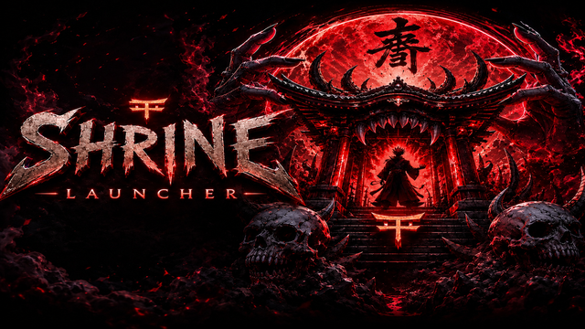

<p align="center">
  
</p>

<h1 align="center">Shrine Launcher</h1>

<p align="center">
  A clean, fast, fully customisable home screen replacement for Amazon Fire TV and Android TV.
  <br/>
  Ad-free. No bloat. Built for people who actually use their TV.
</p>

<p align="center">
  
  
  
</p>

---

## Overview

Shrine Launcher replaces the default Amazon Fire TV home screen with a fast, minimal, fully
customisable interface. No ads. No recommendations you didn't ask for. No subscription.

Rows of apps and streaming content sit near the bottom of the screen over your wallpaper,
exactly where you want them. Everything is navigable with a standard Fire TV remote.

---

## Screenshots

> *Add screenshots here after testing*

---

## Features

### Home Screen
- **Custom rows** — organise your apps and streaming content into named horizontal rows
- **Continue Watching** — pulls live content from any app that supports Android TV's Watch Next API (Nuvio, Stremio, Netflix, Prime Video, etc.)
- **Watch Next** — upcoming episodes and new content from your streaming apps
- **Wallpaper** — set any image as your background, or choose a slideshow that cycles through a collection on a timer
- **Clock and date** — optional clock and date display in the top bar, with 12/24 hour format toggle
- **Empty state messaging** — rows that have no content show a helpful message instead of blank space
- **Pinned rows** — pin any row to always appear at the top of the home screen

### App Management
- **All Apps row** — every installed app in one scrollable row
- **Custom rows** — hand-pick which apps appear in a row and in what order
- **App editor** — toggle apps in/out of a row, reorder with up/down arrows
- **Per-row icon size** — override the global icon size on a per-row basis (S / M / L / XL)
- **Banner mode** — rows can display TV banner art instead of square icons

### Streaming Channels
- **Source filtering** — choose which apps contribute to Continue Watching and Watch Next rows
- **Progress bars** — Continue Watching cards show a progress bar indicating how far through the content you are
- **Dismiss** — long press any channel card to remove it from the row
- **Auto-refresh** — configure each channel row to refresh automatically every 15, 30, 60, or 120 minutes

### Context Menu (long press any app)
- **Open** — launch the app
- **App Info** — jump straight to the system app details page
- **Force Stop** — immediately stop a running app (requires ADB permission, see below)
- **Uninstall** — open the system uninstall flow

### Settings
- **Icon size** — global size picker: S (64dp), M (88dp), L (112dp), XL (144dp)
- **Corner roundness** — adjust card corner radius from sharp to fully rounded
- **Bottom margin** — control how far down the screen your rows sit
- **Start margin** — control the left-edge padding before the first app in each row
- **Wallpaper slideshow** — pick multiple images and set a cycle interval (30s to 30 min)
- **Date & Time** — show/hide clock, show/hide date, 24-hour format toggle
- **Export / Import config** — save your entire setup to a JSON file and restore it on any device
- **Cloud backup** — share your config via any app (Drive, email, etc.) or paste from clipboard
- **Unsaved changes dialog** — prompts you to save or undo if you leave Appearance with unsaved changes

### App Installer
- **Install from URL** — paste a direct APK link, Shrine downloads and installs silently
- **Install from file** — browse your device storage for an APK
- **Silent install** — no system dialog required (requires ADB permission, see below)
- **Graceful fallback** — if silent install is unavailable, opens the standard system installer

---

## Installation

### Standard install
1. Enable **Apps from Unknown Sources** on your Fire TV:
   Settings → My Fire TV → Developer Options → Apps from Unknown Sources → On
2. Download the latest `ShrineLauncher-debug.apk` from the [Actions tab](../../actions)
3. Transfer to your Fire TV via [Downloader](https://www.amazon.com/AFTVnews-com-Downloader/dp/B01N0BP507) or ADB
4. Install and set as your home launcher

### Set as default launcher
On Fire TV, Shrine will prompt you to set it as the default launcher on first open.
If it doesn't, go to: Settings → Applications → Default Apps → Home App → Shrine Launcher

---

## ADB Permission Setup (optional but recommended)

Some features require an elevated permission that must be granted once via ADB.
This enables **Force Stop** from the context menu and **silent APK install** in the App Installer.

**Step 1 — Enable ADB on your Fire TV:**
- Settings → My Fire TV → About → click your device name **7 times** to enable Developer Options
- Settings → My Fire TV → Developer Options → ADB Debugging → **On**
- Settings → My Fire TV → Developer Options → Network ADB → **On**

**Step 2 — Find your Fire TV's IP address:**
- Settings → My Fire TV → About → Network

**Step 3 — Connect from your ADB client and grant permission:**
```bash
adb connect YOUR_FIRE_TV_IP:5555
adb shell pm grant com.shrine.launcher android.permission.WRITE_SECURE_SETTINGS
```

You only need to do this once. The permission persists until Shrine is uninstalled.

---

## Building from Source

Shrine is built via GitHub Actions. No local Android Studio setup is required.

### Prerequisites
- A GitHub account with this repository forked or cloned
- The `assets_setup.py` file committed to `.github/assets_setup.py` (contains image assets)

### Build steps
1. Go to the **Actions** tab in your GitHub repository
2. Select **Build Shrine Launcher APK**
3. Click **Run workflow**
4. Download the APK from the workflow artifacts when complete

### Project structure
```
app/
├── src/main/java/com/shrine/launcher/
│   ├── data/
│   │   ├── model/          # LauncherRow, LauncherPrefs, TvContent, AppInfo
│   │   └── repository/     # PreferencesRepository, TvContentRepository, AppRepository
│   ├── ui/
│   │   ├── home/           # HomeActivity, HomeViewModel, RowsAdapter, AppsAdapter, ChannelAdapter
│   │   ├── installer/      # AppInstallerActivity
│   │   └── settings/       # SettingsActivity, RowsListAdapter, WidgetsListAdapter
│   └── util/               # ConfigManager, ThemeUtil, TvDatabaseObserver
└── src/main/res/
    ├── layout/             # Layouts for all activities and row/card items
    ├── drawable/           # Focus selectors, card backgrounds, icons
    └── values/             # colours.xml, themes.xml, strings.xml
```

---

## TV Channels — Technical Notes

Shrine reads from Android TV's standard TvProvider database to populate Continue Watching
and Watch Next rows. For an app to appear in these rows it must write to the
`WatchNextPrograms` or `PreviewPrograms` content provider — which is the standard Android TV
API for this purpose.

**Compatible apps include:** Nuvio, Stremio, Netflix, Amazon Prime Video, Disney+,
and any other app that implements the Android TV Channels API.

Shrine queries all Watch Next records without type filtering and categorises them in Kotlin
after retrieval, which means it picks up content from apps that don't consistently set the
`WATCH_NEXT_TYPE_CONTINUE` field — a common issue with third-party streaming apps.

If a channel row is empty, Shrine falls back to querying `PreviewPrograms` directly,
which catches apps that publish Continue Watching content via channels rather than Watch Next.

---

## Version History

| Version | Notes |
|---------|-------|
| 0.8.0 | Settings cleanup, date display, slideshow wallpaper, app installer, channel filtering, per-row icon size, auto-refresh, empty states, unsaved changes dialog |
| 0.7.x | Channels integration (Continue Watching, Watch Next), TvContractCompat fixes |
| 0.6.x | Side panel, export/import, branding, red colour scheme |
| 0.5.x | Settings overhaul, focus improvements, app editor |
| 0.4.x | Initial channel support, wallpaper, clock |
| 0.1–0.3 | Core launcher structure, row management, app adapters |

---

## Roadmap

- [ ] Icon pack support
- [ ] Wallpaper brightness / blur controls
- [ ] Scroll position memory
- [ ] Search / app filter
- [ ] Progress bar on Continue Watching cards *(in progress)*
- [ ] Remote button remapping via accessibility service

---

## Credits

Built with:
- [Glide](https://github.com/bumptech/glide) — image loading
- [AndroidX TvProvider](https://developer.android.com/reference/androidx/tvprovider/media/tv/package-summary) — TV channels API
- [Gson](https://github.com/google/gson) — config serialisation

Inspired by [Projectivy Launcher](https://github.com/spocky/projectivy) and
[AT4K Launcher](https://at4kapp.com/).

---

## Licence

Personal use only. Not for redistribution.
